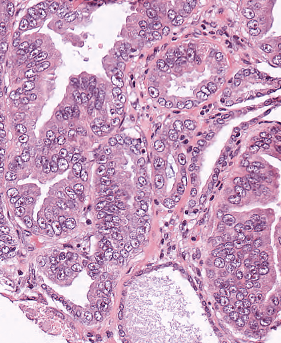
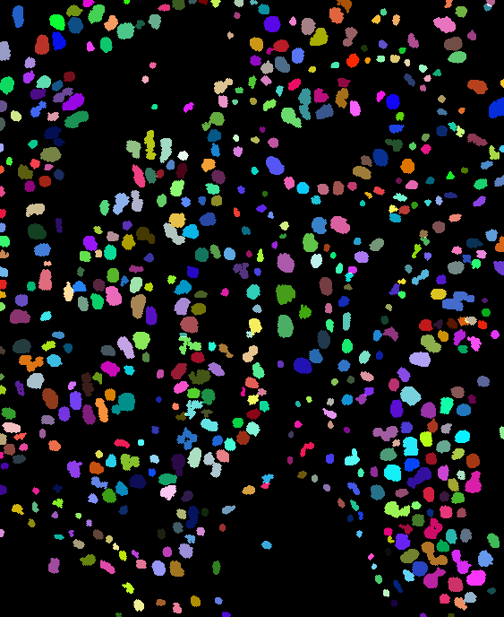

# nuclei-net

Code related to my Bachelor's Thesis Project

# Results so far
The following is a glimpse of the segmentation results we have obtained so far -

Test Image | Segmentation results
-----------|---------------------
 | 

# Introduction

	Detection and segmentation of nuclei in histopathological images has numerous biomedical applications. 
	The conventional method involves manual inspection and analyses performed by pathologists to make 
	diagnostic and prognostic assessments based on certain features of the cell.

	We have trained a Convolutional Neural network to achieve the detection and segmentation of nuclei in 
	H&E stained images. 

# Data Preparation and Processing
	The CNN takes as input image patches of varying sizes.
	The classes used for training and testing must also be equally likely.
	The scripts pertaining to the data preparation, pre-processing and post-processing are present in the 
	folder named 'Data'.

# Running the Conv Net
	There are two scripts for training the CNN - One in caffe and one in torch.
	Currently, we're using torch for training.

	- Inorder to use the Caffe model :
		- Put `caffe-scripts/nuclei` in `CAFFE_ROOT/examples/nuclei` to make the scripts work
	    - `caffe-scripts/nuclei` contains:
	      - `multi_class_nuclei`: this was trained on data of 10 classes from different whole slide images.
	      - `multi_class_nuclei/use_multi_class`: Model from multi_class_nuclei was finetuned for the nucleus binary classification.
	      - `train_cifar`: the model was trained on cifar-10 data and then fintuned on nuclei data.
	    - `caffe-scripts/predict.py`: used to predict labels by using a trained model. Put this in your CAFFE_ROOT.
	  - `data` contains images and scripts for preparing data for both Caffe and Theano.